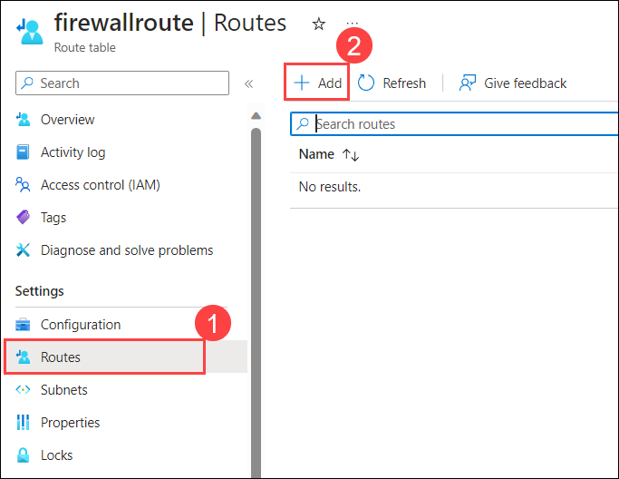

# Exercise 3: Enforce Branch-to-Branch Inspection

The exercise focuses on configuring rules, testing the webpage through Firewalls, and configuring routing intent and policies through the Virtual WAN portal.

## Task 1: Configure rules and testing webpage through Firewalls

In this task, you are configuring firewall rules in the Azure portal, setting up routes, associating subnets, and enabling TLS inspection in the Firewall Policy. Obtain the Firewall's private IP and add a route to redirect traffic. Connect to a VM using Bastion, encounter blocked webpage errors, and configure TLS inspection and application rules. Redirect traffic through the Firewall with defined rules for secure browsing.

1. In the Azure portal, type **Firewalls (1)** in the search box and select **Firewalls (2)** from the results.

    

1. Click on the **AzureFirewall**.

    

1. Copy the **Private IP** and save it to Notepad for later use.

    

1. Navigate to the **Onprem-RG-<inject key="DeploymentID" enableCopy="false"/>** resource group and select the Route Table **firewallroute**.

    

1. On the Route table page, select **Routes (1)** under Settings and click on **+ Add (2)**.

    

1. Under the **Add Route** page, enter the below information:
  
    - Route Name: Enter **firewallroute (1)**

    - Address prefix destination: Select **IP Addresses (2)** from the drop-down list
    
    - Destination IP address/ CIDR ranges: Enter **0.0.0.0/0 (3)**
    
    - Next hop type: Select **Virtual appliance (4)** from the drop-down list
    
    - Next hop address: Enter the **private IP Address** of the Firewall **(5)**.
    
    - Select **Add (6)**

        

1. On the Route table page, select **Subnets (1)** under Settings and click on **+ Associate (2)**.

    

1. Under the **Associate subnet** page, enter the below information:

     - Virtual Network: Select **Onprem-Gatewayvnet-<inject key="DeploymentID" enableCopy="false"/> (Onprem-RG-<inject key="DeploymentID" enableCopy="false"/>) (1)** from the drop-down list.

     - Subnet: Select **dbvmsubnet (2)** from the drop-down list.

     - Click on **OK (3)**.

        

1. Navigate to your **Onprem-RG-<inject key="DeploymentID" enableCopy="false"/>** resource group and select **DBVM-<inject key="Deployment ID" enableCopy="false"/>**. 

    

1. On the Virtual Machine page, under Settings, click on **Connect (1)** then click on **Go to Bastion (2)**.

    

1. On the Bastion page, follow the below-mentioned instructions to connect to the Virtual Machine using Bastion:
 
    - **Username**: Enter **demouser (1)**
    - **Authentication Type**: Select **Password (2)** from the drop-down
    - **Password**: Enter **<inject key="LabVM Admin Password" enableCopy="true"/> (3)**
    - Click on **Connect (4)**

        

1. Now, you will be redirected to a new tab where the Bastion VM is opened. If you see the pop-up **See text and images copied to the clipboard**, click on **Allow**.

    

1. Within the Bastion VM, search for **Edge (1)** and select **Microsoft Edge (2)**.

    

1. Navigate to the below-mentioned URL and you can see the error **can't reach this page**.
 
   ```
   https://www.nfl.com
   ```

    
   
1. Navigate back to the other tab, where Azure Portal is opened.
 
1. In the Azure portal, go to your **Onprem-RG-<inject key="DeploymentID" enableCopy="false"/>** resource group and select **firewallpolicy**.

    

1. Select **TLS inspection (1)** under the Settings tab and enter the below details under the **Key vault** tab:
 
    - Parent policy: Choose **Enabled (2)**

    - Managed Identity: Select **(New) fw-cert-id-ZrNC4l8WLg97D  (3)** from the drop-down list
    
    - Key Vault: Select **(New) fw-cert-kv-ZrNC4l8WLg97D (4)** from the drop-down list
    
    - Certificate: Select **(New) fw-cert-ZrNC4l8WLg97D (5)** from the drop-down list
    
    - Click on **Save (6)**

        

1. Now, select **Application Rules (1)** from the Settings tab under the Firewall Policy page and select **+ Add a rule collection (2)**.

    

1. Under the **Add a rule collection** page, enter the below details to enable the web application in Bastion VM:
 
    - Name: **GeneralWeb (1)**
    - Rule Collection type: **Application (2)**
    - Priority: **103 (3)**
    - Rule collection group: **DefaultApplicationRuleCollectionGroup (4)**
    - Under **Rules (5)** mention the below details:
      - Name: **AllowSports**
      - Source type: Select **IP Address** from the drop-down list
      - Source: Enter *
      - Protocol: Enter **http,https**
      - TLS inspection: Check TLS inspection
      - Destination Type: Select **Web categories**
      - Destination: Enter `Sports`
     
     - Click on **Add (6)**

        

1. Once the deployment completes navigate back to the Bastion VM tab and refresh the page where you have browsed for `https://www.nfl.com`. On the Privacy error connection page, click on **Advanced**.

    

1. Click on **Continue to www.nfl.com (unsafe)**.
 
    

    >**Note**: If you have trouble reaching www.nfl.com, try www.nba.com or www.nhl.com.
     
1. Now you can see the NFL web page.

    

## Task 2: Configure routing intent and policies through the Virtual WAN portal

In this task, you are configuring routing intent and routing policies on your Virtual Hub using Azure Firewall Manager.

1. Navigate to the home page in the Azure portal, type **Virtual WANs (1)** in the search box and select **Virtual WANs (2)** from the results.

    

1. On the **Virtual WANs** page, select **vwan-prod-001**.

   

1. On the **Basics** tab of the **vwan-prod-001** page, select **Hubs (1)** under the Connectivity section from the left navigation pane, and then click on **vwan-hub-prod-002 (2)**.

   

1. On the **vwan-hub-prod-002** hub, click on **Manage security provider and route settings for this Secured virtual hub in Azure Firewall Manager**.

    

1. Click on **vwan-hub-prod-002** secure virtual hub.

    

1. Select **Security configuration (1)** under Settings, and enter or select the following information:

   - Select **Azure Firewall (2)** from the dropdown for Internet Traffic.

   - Select **Send via Azure Firewall (3)** from the dropdown for Private Traffic.

   - Select **Disabled (4)** from the dropdown for Inter-hub. Enabling this option ensures your Routing Policies are applied to the Routing Intent of this Virtual WAN Hub.

   - Select **Save (5)** and **OK**.
  
      

## Summary:

In this exercise, you have covered the following:

- Configured rules and tested the webpage through firewalls.
- Configured routing intent and policies through the Virtual WAN portal
