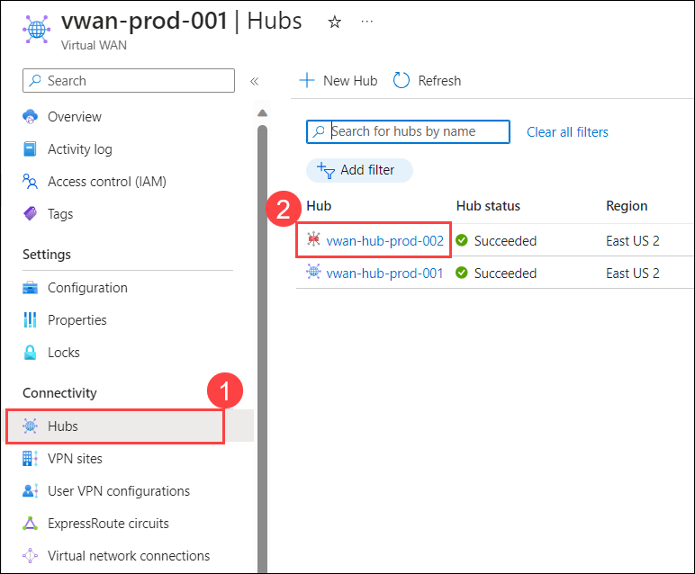

# Exercise 3: Isolate, Monitor and Remediate Azure vWAN Networking Issues

In this exercise you will learn how to troubleshoot, isolate, and remediate common networking issues.

## Task 1: View Azure vWAN Hub Effective Routes

1. Navigate to the home page in the Azure portal, type **Virtual WANs (1)** in the search box and select **Virtual WANs (2)** from the results.

    

1. On the **Virtual WANs** page, select **vwan-prod-001**.

   

1. On the **Basics** tab of the **vwan-prod-001** page, select **Hubs (1)** under the Connectivity section from the left navigation pane, and then click on **vwan-hub-prod-002 (2)**.

   

1. On the **Virtual HUB** page, in the left pane, select **Route Tables**. The Route Tables page will populate the current route tables for this hub.

1. Select **+ Create route table** to open the Create Route Table page.

1. On the **Basics** page, enter the below information:

    - Name: Enter **test-route-table (1)**

    - Route name: Enter **route (2)**

    - Destination type: Select **CIDR** from the dropdown.

    - Destination prefix: Enter **

    - Next hop: 

1. On the **Labels** page, type **label-data (1)** under label names. Labels provide a mechanism to logically group route tables and then move to the **Associations (2)** page.

1. On the **Associations** page, associate connections to the route table. You'll see **Branches**, **Virtual Networks**, and the **Current settings** of the connections. Select **all virtual networks** under virtual network(s) section, then move to the **Propagations** page.

1. On the **Propagations** page, Select **all virtual networks** under virtual network(s) section, then click on **Create** to create the route table.

1. On the **vwan-hub-prod-002** Virtual HUB, select **Effective Routes** under Routing.

1. From the dropdown, you can select **Route Table (1)** under choose resources type to view routes and select **test-route-table** under Resources.

    >**Note**: If you don't see a Route Table option, this means that you don't have a custom or default route table set up in this virtual hub.

1. To download this information to a csv file, click **Download** at the top of the page.

