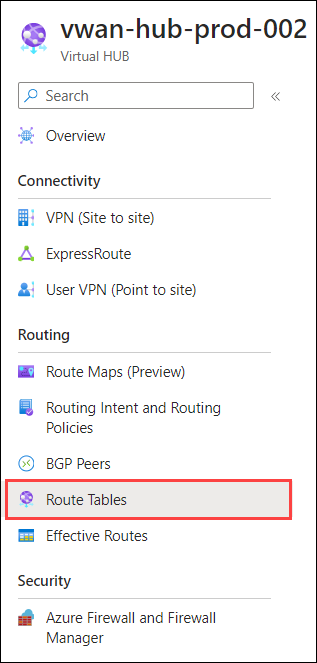
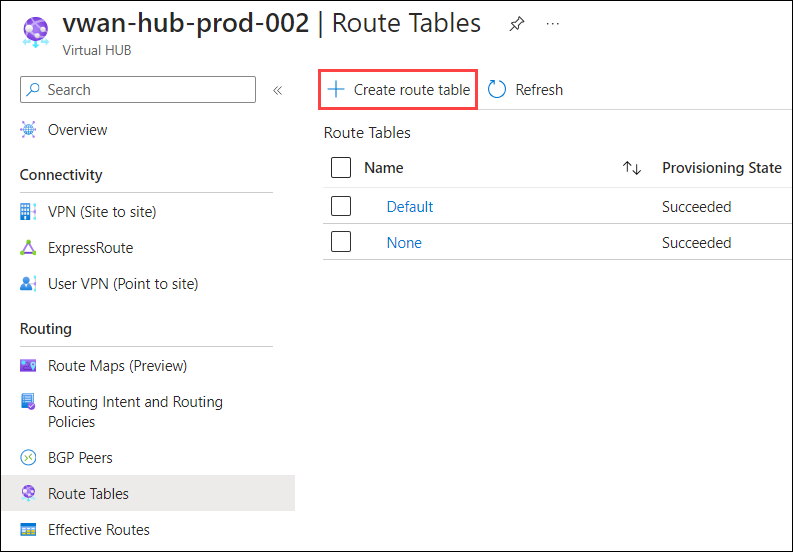
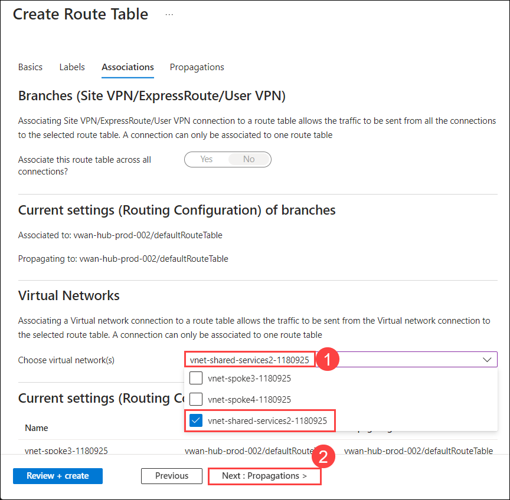
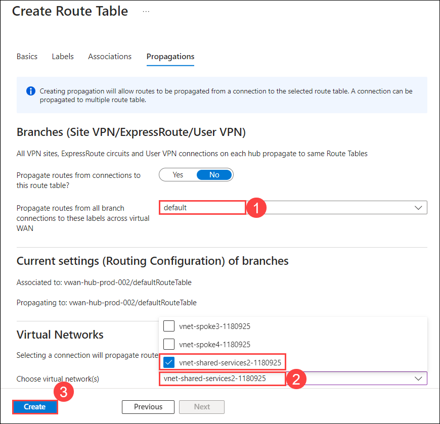
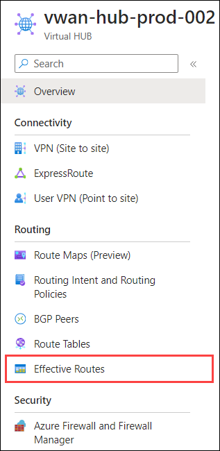
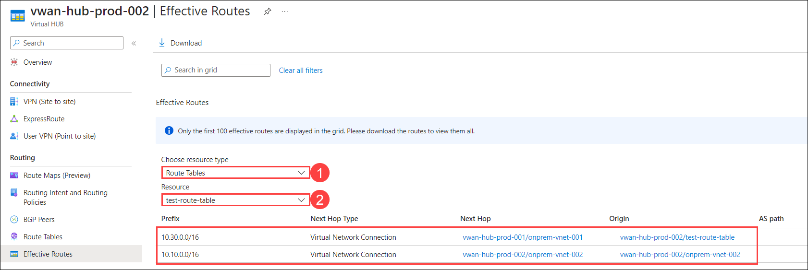
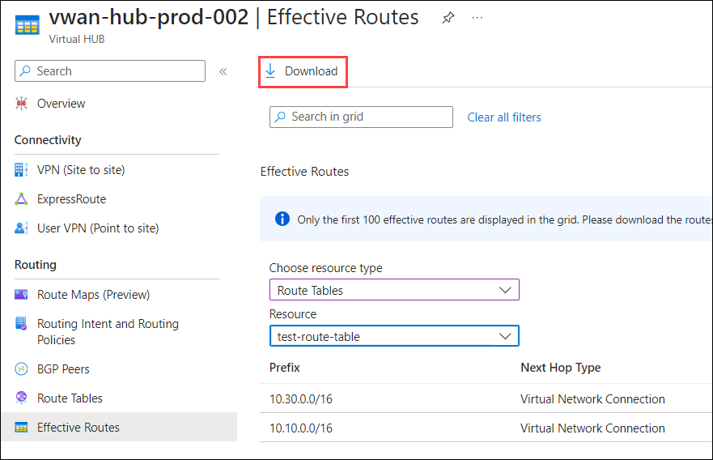
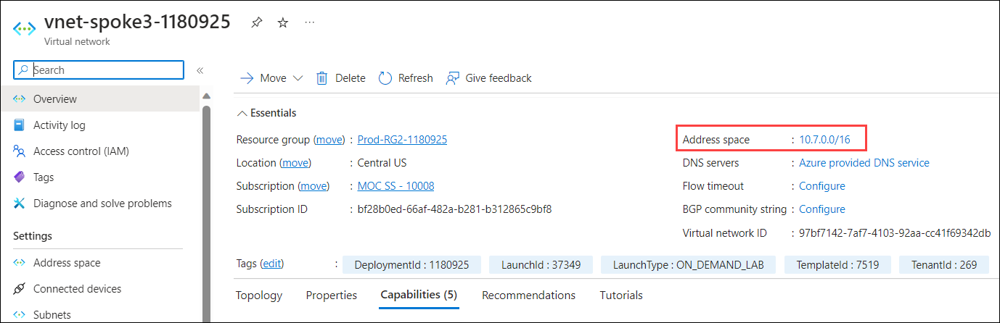
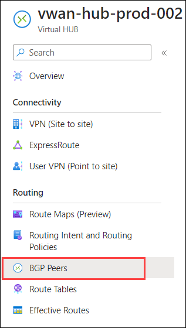
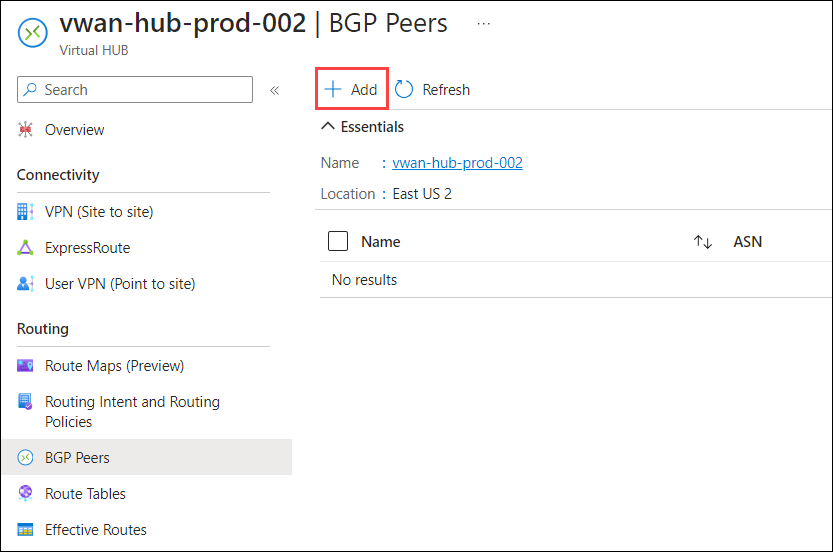

# Exercise 3: Isolate, Monitor and Remediate Azure vWAN Networking Issues

In this exercise you will learn how to troubleshoot, isolate, and remediate common networking issues.

## Task 1: View Azure vWAN Hub Effective Routes

1. In the Azure portal, type type **Virtual WANs (1)** in the search box and select **Virtual WANs (2)** from the results.

    

1. On the **Virtual WANs** page, select **vwan-prod-001**.

   

1. On the **vwan-prod-001** page, select **Hubs (1)** under the Connectivity section from the left navigation pane, and then click on **vwan-hub-prod-002 (2)**.

   

1. On the **Virtual HUB** page, in the left pane, select **Route Tables**. The Route Tables page will populate the current route tables for this hub.

    

1. Select **+ Create route table** to open the Create Route Table page.

    

1. On the **Basics** page, enter the below information and click on **Next : Labels > (6)**

    - Name: Enter **test-route-table (1)**

    - Route name: Enter **route (2)**

    - Destination type: Select **CIDR (3)** from the drop-down

    - Destination prefix: Enter **10.30.0.0/16 (4)**

    - Next hop: Select **vwan-hub-prod-001/onprem-vnet-001 (5)** from the drop-down

        

1. On the **Labels** page, type **route-label (1)** under Labels Name. Labels provide a mechanism to logically group route tables and then move to the **Next : Associations > (2)** page.

    

1. On the **Associations** page, associate connections to the route table. You'll see **Branches**, **Virtual Networks**, and the **Current settings** of the connections. Select **vnet-shared-services2-<inject key="DeploymentID" enableCopy="false"/> (1)** under virtual network(s) section, then move to the **Next : Propagations > (2)** page.

    

1. On the **Propagations** page, Select **default (1)** under Propagate routes from all branch connections to these labels across virtual WAN, select **vnet-shared-services2-<inject key="DeploymentID" enableCopy="false"/> (2)** under Virtual Networks section, then click on **Create (3)** to create the route table.

    

1. On the **vwan-hub-prod-002** Virtual HUB, select **Effective Routes** under Routing.

    

1. From the dropdown, you can select **Route Table (2)** under choose resources type to view routes, select **test-route-table (3)** under Resources and you will able to see the resources.

    

    >**Note**: If you don't see a Route Table option, this means that you don't have a custom or default route table set up in this virtual hub.

1. To download this information to a csv file, click **Download** at the top of the page.

    

## Task 2: View BGP Peers & Details for Azure vWAN

1. In the Azure portal, type **Virtual networks (1)** in the search box and select **Virtual networks (2)** from the results.

    

1. Click on **vnet-spoke3-<inject key="DeploymentID" enableCopy="false"/>**.

    

1. Copy the **Address space** and paste it in notepad for later use.

    

1. Navigate to the home page in the Azure portal, type **Virtual WANs (1)** in the search box and select **Virtual WANs (2)** from the results.

    

1. On the **Virtual WANs** page, select **vwan-prod-001**.

   

1. On the **vwan-prod-001** page, select **Hubs (1)** under the Connectivity section from the left navigation pane, and then click on **vwan-hub-prod-002 (2)**.

    

1. On the **vwan-hub-prod-002** Virtual HUB, select **BGP Peers** under Routing.

    

1. On the BGP Peers page, click **+ Add** to add a BGP peer.

    

1. Under the **Add BGP Peer** page, enter or select the following information.

    - Name: Enter **BGP-Peer (1)**

    - ASN: Enter **65510 (2)**

    - IPv4 address: Enter the **Address space (3)** that you copied in step 3

    - Virtual Network connection: Select **vwan-vnet-003 (4)**

        

