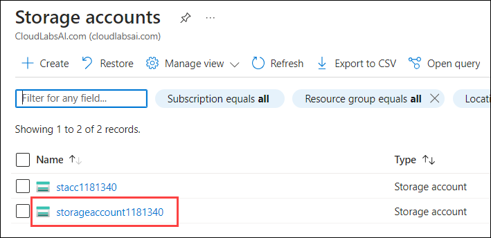

# Exercise 4: Isolate, Monitor, and Remediate Azure vWAN Networking Issues

The exercise focuses on troubleshooting Azure vWAN networking issues. It covers viewing effective routes, configuring BGP peers, monitoring advertised and learned routes, utilizing Azure Monitor Insights, and setting up packet captures for site-to-site VPNs. It involves creating route tables, adding BGP peers, exploring route details, and using Azure Monitor for insights. Packet capture setup involves creating a storage container, generating SAS URLs, and initiating, stopping, and viewing captures. These steps aid in diagnosing and remedying common Azure vWAN network problems, ensuring efficient network management and troubleshooting.

## Task 1: View Azure virtual WAN Hub Effective Routes

1. In the Azure portal, type **Virtual WANs (1)** in the search box and select **Virtual WANs (2)** from the results.

    

1. On the **Virtual WANs** page, select **vwan-prod-001**.

   

1. On the **vwan-prod-001** page, select **Hubs (1)** under the Connectivity section from the left navigation pane, and then click on **vwan-hub-prod-002 (2)**.

   .png)

1. On the **Virtual HUB** page, in the left pane, select **Route Tables (1)** under Routing tab and Select **+ Create route table (2)** to Create Route Table.

    .png)

1. On the **Basics** tab, enter the below information and click on **Next : Labels > (6)**

    - Name: Enter **test-route-table (1)**

    - Route name: Enter **route (2)**

    - Destination type: Select **CIDR (3)** from the drop-down

    - Destination prefix: Enter **10.30.0.0/16 (4)**

    - Next hop: Select **vwan-hub-prod-001/onprem-vnet-001 (5)** from the drop-down

        

1. On the **Labels** tab, type **route-label (1)** under Labels Name. Labels provide a mechanism to logically group route tables and then move to the **Next : Associations > (2)** page.

    

1. On the **Associations** tab, associate connections to the route table. You'll see **Branches**, **Virtual Networks**, and the **Current settings** of the connections. Select **vnet-shared-services2-<inject key="DeploymentID" enableCopy="false"/> (1)** under virtual network(s) section, then move to the **Next : Propagations > (2)** page.

    .png)

1. On the **Propagations** tab, select **vnet-shared-services2-<inject key="DeploymentID" enableCopy="false"/> (1)** under Virtual Networks section, then click on **Create (2)** to create the route table.

    .png)

1. On the **vwan-hub-prod-002** Virtual HUB, select **Effective Routes** under Routing section.

    .png)

1. From the dropdown, you can select **Route Table (1)** under choose resources type to view routes, select **test-route-table (2)** under Resources and you will able to see the resources.

    .png)

    >**Note**: If you don't see a Route Table option, this means that you don't have a custom or default route table set up in this virtual hub.

1. To download this information to a CSV file, click **Download** at the top of the page.

    .png)

## Task 2: View BGP Peers & Details for Azure Virtual WAN

This task helps you monitor Virtual WAN site-to-site VPN BGP information using the BGP Dashboard. Using the BGP dashboard, you can monitor BGP peers, advertised routes, and learned routes. The BGP dashboard is available for site-to-site VPNs that are configured to use BGP. The BGP dashboard can be accessed on the page for the site that you want to monitor.

### **Create a BGP Peers**

1. In the Azure portal, type **Virtual networks (1)** in the search box and select **Virtual networks (2)** from the results.

    

1. Click on **vnet-spoke3-<inject key="DeploymentID" enableCopy="false"/>**.

    

1. Copy the **Address space - 10.7.0.0** and paste it into Notepad for later use.

    .png)

    > **Note:** Please do **not** include the **/16** at the end.

1. Navigate to the home page in the Azure portal, type **Virtual WANs (1)** in the search box and select **Virtual WANs (2)** from the results.

    

1. On the **Virtual WANs** page, select **vwan-prod-001**.

   

1. On the **vwan-prod-001** page, select **Hubs (1)** under the Connectivity section from the left navigation pane, and then click on **vwan-hub-prod-002 (2)**.

    .png)

1. On the **vwan-hub-prod-002** Virtual HUB page, select **BGP Peers (1)** under Routing tab and click **+ Add (2)** to add a BGP peer.

    .png)

1. Under the **Add BGP Peer** page, enter or select the following information and select **Add (5)**.

    - Name: Enter **BGP-Peer (1)**

    - ASN: Enter **65510 (2)**

    - IPv4 address: Enter the **Address space - 10.7.0.0 (3)** that you copied in step 3

    - Virtual Network connection: Select **vwan-vnet-003 (4)**

        

1. On the **BGP Peers** page, copy one of the **IP** and save it to notepad for later use.

    .png)

1. On the **vwan-hub-prod-002** Virtual HUB page, select **VPN (Site to site) (1)** under Connectivity section and click on **on-prem-2 (2)** to open the VPN site.

    .png)

1. Click on **... (1)**, and select **Edit link (2)**.

    

1. On the **Edit link** page, enter the following information:

    - Link BGP address: Enter the **IP (1)** that you copied in step 10.

    - Link ASN: Enter **65510 (2)**

    - Click on **Confirm (3)**

        

1. On the **on-prem-2** Virtual HUB page, select **BGP Dashboard** under Connectivity section.

    

1. To download this information to a CSV file, click **Download BGP peers** at the top of the page.

    

### **Advertised routes**

The **Advertised Routes** page contains the routes that are being advertised to remote sites.

1. On the **BGP Peers** page, click **Routes the site-to-site gateway is advertising** to show the **Advertised Routes** page.

    

1. On the **Advertised Routes** page, you can view the top 50 BGP routes. To view all routes, click **Download advertised routes**.

    

### **Learned routes**

The **Learned Routes** page shows the routes that are learned.

1. On the **BGP Dashboard** page, click **Routes the site-to-site gateway is learning** to show the **Learned Routes** page.

    

1. On the **Learned Routes** page, you can view the top 50 BGP routes. To view all routes, click **Download learned routes**.

    

## Task 3: Azure Monitor Insights for Virtual WAN

Azure Monitor Insights for Azure Virtual WAN allows users and operators to view the state and status of a Virtual WAN, presented via an auto-discovered topological map. It provides a snapshot view of the overall health of the WAN, with resource configuration pages accessible through one-click access.

1. Navigate to the home page in the Azure portal, type **Virtual WANs (1)** in the search box and select **Virtual WANs (2)** from the results.

    

1. On the **Virtual WANs** page, select **vwan-prod-001**.

   

1. On the **vwan-prod-001** Virtual WAN page, select **Insights** under monitor section.

    .png)

1. The Insights view appears. It shows the Virtual WAN **Dependency map**.

    .png)

## Task 4: Configure a packet capture for Virtual WAN site-to-site VPN

This task demonstrates how to create packet captures for an Azure Virtual WAN site-to-site VPN gateway using the Azure portal. It helps identify network issues, enabling efficient debugging and remedial action. Despite the availability of tools, the filtering capabilities of Virtual WAN packet capture make it a superior option.

### **Create a Container**

1. In the Azure portal, type **Storage account (1)** in the search box and select **Storage accounts (2)** from the results.

    

1. On the **Storage accounts** page, select **storageaccount<inject key="DeploymentID" enableCopy="false"/>**.

    

1. In the left menu for the storage account, select **Containers (1)** under the Data storage section and select the **+ Container (2)** button.

    .png)

1. On the **New container** blade, enter or select the following information:

    - Name: **packet (1)**

    - Anonymous access level: **Private (no anonymous access) (By default its selected) (2)**
    
    - Click on **Create (3)**

        

### **Generate the SAS token and URL**

1. Navigate to your newly created container named **packet**.

1. Under Settings, select **Shared access tokens (1)**.

1. On the Permissions tab, verify that both **Read (2)** and **Write (2)** are enabled.

1. At the bottom of the page, click the **Generate SAS token and URL button (3)**.

    

1. Click to copy the **Blob SAS URL** link that is generated to your clipboard.

    

### **Start a packet capture**

In this section, you start the packet capture on the virtual hub.

1. Navigate to the home page in the Azure portal, type **Virtual WANs (1)** in the search box and select **Virtual WANs (2)** from the results.

    

1. On the **Virtual WANs** page, select **vwan-prod-001**.

   

1. On the **vwan-prod-001** page, select **Hubs (1)** under the Connectivity section from the left navigation pane, and then click on **vwan-hub-prod-002 (2)**.

    .png)

1. Now, select **VPN (Site to site) (1)** under the Connectivity section and select **Packet Capture (2)**.

    .png)

1. On the **Packet Capture** page, click on **Start** to capture all the packets on the Site to Site VPN Gateway.

    

1. On the **Start Packet Capture** page, modify settings if needed. See the Filters section for options. and click on the **Start** button to start the packet capture.

    

### **Stop a packet capture**

This section helps you stop or abort a packet capture.

1. On the **Packet Capture** page, click on **Stop** button. This opens the Stop Packet Capture page. At this point, the packet capture hasn't yet stopped.

    

1. On the **Stop Packet Capture** page, paste the SAS URL for the storage container that you created earlier into the **Output Sas Url** field. This is the location where the packet capture files will be stored.

    

1. Next, click **Stop**. The packet capture will stop and the PCAP file will be created and saved to the storage account. This can take a few minutes to complete.

### **View a packet capture**

This section helps you download the packet capture PCAP file to view.

1. In the Azure portal, navigate to the **Storage account** that you created.

1. Click **Containers** to view the containers for the storage account.

1. Click the container that you created named **packet**.

1. Navigate through the folder structure to locate your PCAP file. The folder name and structure are based on the date and UTC time. When you locate the PCAP file, click **Download**.

    

1. Packet capture data files are generated in PCAP format. You can use Wireshark to open PCAP files.

## Summary:

In this exercise, you have covered the following:

- Viewed Azure vWAN Hub Effective Routes
- Configured BGP Peers and details for Azure Virtual WAN
- Set up Azure Monitor Insights for Virtual WAN
- Configured a packet capture for Virtual WAN site-to-site VPN

### You have successfully completed the lab.
