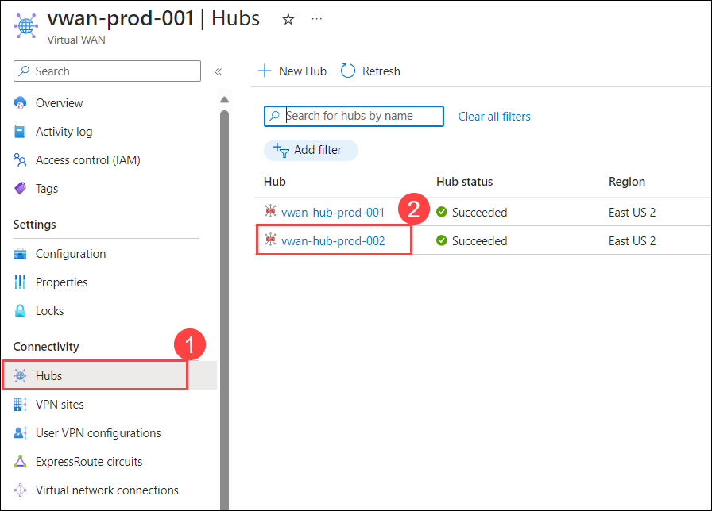

# Exercise 3: Isolate, Monitor and Remediate Azure vWAN Networking Issues

In this exercise you will learn how to troubleshoot, isolate, and remediate common networking issues.

## Task 1: View Azure vWAN Hub Effective Routes

1. In the Azure portal, type type **Virtual WANs (1)** in the search box and select **Virtual WANs (2)** from the results.

    

1. On the **Virtual WANs** page, select **vwan-prod-001**.

   

1. On the **vwan-prod-001** page, select **Hubs (1)** under the Connectivity section from the left navigation pane, and then click on **vwan-hub-prod-002 (2)**.

   

1. On the **Virtual HUB** page, in the left pane, select **Route Tables**. The Route Tables page will populate the current route tables for this hub.

    

1. Select **+ Create route table** to open the Create Route Table page.

    

1. On the **Basics** page, enter the below information and click on **Next : Labels > (6)**

    - Name: Enter **test-route-table (1)**

    - Route name: Enter **route (2)**

    - Destination type: Select **CIDR (3)** from the drop-down

    - Destination prefix: Enter **10.30.0.0/16 (4)**

    - Next hop: Select **vwan-hub-prod-001/onprem-vnet-001 (5)** from the drop-down

        

1. On the **Labels** page, type **route-label (1)** under Labels Name. Labels provide a mechanism to logically group route tables and then move to the **Next : Associations > (2)** page.

    

1. On the **Associations** page, associate connections to the route table. You'll see **Branches**, **Virtual Networks**, and the **Current settings** of the connections. Select **vnet-shared-services2-<inject key="DeploymentID" enableCopy="false"/> (1)** under virtual network(s) section, then move to the **Next : Propagations > (2)** page.

    

1. On the **Propagations** page, Select **default (1)** under Propagate routes from all branch connections to these labels across virtual WAN, select **vnet-shared-services2-<inject key="DeploymentID" enableCopy="false"/> (2)** under Virtual Networks section, then click on **Create (3)** to create the route table.

    

1. On the **vwan-hub-prod-002** Virtual HUB, select **Effective Routes** under Routing.

    

1. From the dropdown, you can select **Route Table (2)** under choose resources type to view routes, select **test-route-table (3)** under Resources and you will able to see the resources.

    

    >**Note**: If you don't see a Route Table option, this means that you don't have a custom or default route table set up in this virtual hub.

1. To download this information to a csv file, click **Download** at the top of the page.

    

## Task 2: View BGP Peers & Details for Azure vWAN

Using the BGP dashboard, you can monitor BGP peers, advertised routes, and learned routes. The BGP dashboard is available for site-to-site VPNs that are configured to use BGP. The BGP dashboard can be accessed on the page for the site that you want to monitor.

### Task 2.1: Create an BGP Peers

1. In the Azure portal, type **Virtual networks (1)** in the search box and select **Virtual networks (2)** from the results.

    

1. Click on **vnet-spoke3-<inject key="DeploymentID" enableCopy="false"/>**.

    

1. Copy the **Address space** and paste it in notepad for later use.

    

1. Navigate to the home page in the Azure portal, type **Virtual WANs (1)** in the search box and select **Virtual WANs (2)** from the results.

    

1. On the **Virtual WANs** page, select **vwan-prod-001**.

   

1. On the **vwan-prod-001** page, select **Hubs (1)** under the Connectivity section from the left navigation pane, and then click on **vwan-hub-prod-002 (2)**.

    

1. On the **vwan-hub-prod-002** Virtual HUB page, select **BGP Peers** under Routing.

    

1. On the BGP Peers page, click **+ Add** to add a BGP peer.

    

1. Under the **Add BGP Peer** page, enter or select the following information.

    - Name: Enter **BGP-Peer (1)**

    - ASN: Enter **65510 (2)**

    - IPv4 address: Enter the **Address space (3)** that you copied in step 3

    - Virtual Network connection: Select **vwan-vnet-003 (4)**

        

1. On the **BGP Peers** page, copy one of the **IP** and save it to notepad for later use.

    

1. On the **vwan-hub-prod-002** Virtual HUB page, select **VPN (Site to site) (1)** under Connectivity section and click on **on-prem-2 (2)** to open the VPN site.

    

1. Click on **... (1)**, and select **Edit link (2)**.

    

1. On the **Edit link** page, enter the following information:

    - Link BGP address: Enter the **IP (1)** that you copied in step 10.

    - Link ASN: Enter **65510 (2)**

    - Click on **Confirm (3)**

        

1. On the **on-prem-2** Virtual HUB page, select **BGP Dashboard** under Connectivity section.

    

1. To download this information to a csv file, click **Download BGP peers** at the top of the page.

    

### Task 2.2: Advertised routes

The **Advertised Routes** page contains the routes that are being advertised to remote sites.

1. On the **BGP Peers** page, click **Routes the site-to-site gateway is advertising** to show the **Advertised Routes** page.

    

1. On the **Advertised Routes** page, you can view the top 50 BGP routes. To view all routes, click **Download advertised routes**.

    

### Task 2.3: Learned routes

The **Learned Routes** page shows the routes that are learned.

1. On the **BGP Dashboard** page, click **Routes the site-to-site gateway is learning** to show the **Learned Routes** page.

    

1. On the **Learned Routes** page, you can view the top 50 BGP routes. To view all routes, click **Download learned routes**.

    

## Task 3: Azure Monitor Insights for Virtual WAN

Azure Monitor Insights for Azure Virtual WAN allows users and operators to view the state and status of a Virtual WAN, presented via an autodiscovered topological map. It provides a snapshot view of the overall health of the WAN, with resource configuration pages accessible through one-click access.

1. Navigate to the home page in the Azure portal, type **Virtual WANs (1)** in the search box and select **Virtual WANs (2)** from the results.

    

1. On the **Virtual WANs** page, select **vwan-prod-001**.

   

1. On the **vwan-prod-001** Virtual WAN page, select **Insights** under monitor section.

    

1. The Insights view appears. It shows the Virtual WAN **Dependency map** and high-level **Metrics** mini workbook.

    

### **Dependency View**

The **Dependency view** for Virtual WAN helps you visualize the interconnected view of all the Virtual WAN resources broadly organized into a hub-and-spoke architecture.

### **Navigate to resource-specific information**

The dependency map enables easy navigation to the configuration settings of each resource. For example, you can hover over the **hub (1)** resource to view the basic resource configuration, like hub region and hub prefix. Click on **Open resource blade (2)** to access the Azure portal page of the hub resource.

### **Search and Filtering**

The search and filter bar in the Dependency view provides an easy way to search through the graph. Various filters provide help to narrow your search down to a specific path and state.

### **Detailed metrics**

You can select **View detailed metrics** to access the detailed Metrics page. The **Metrics** page is a dashboard that's preconfigured with separate tabs. These tabs provide insights into your Virtual WAN resource capacity, performance, and utilization at the Virtual-WAN level and hub level, and at the level of individual connections.

