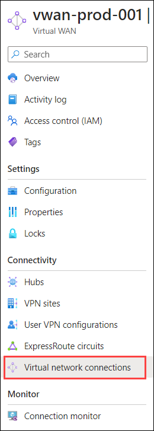
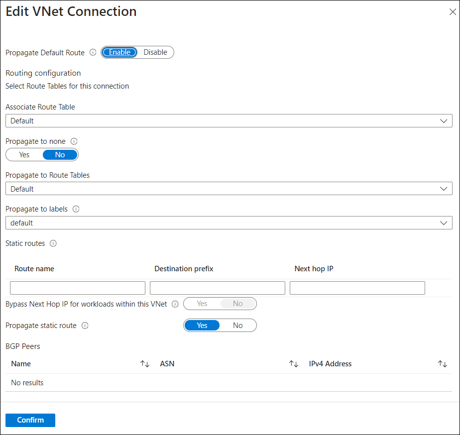
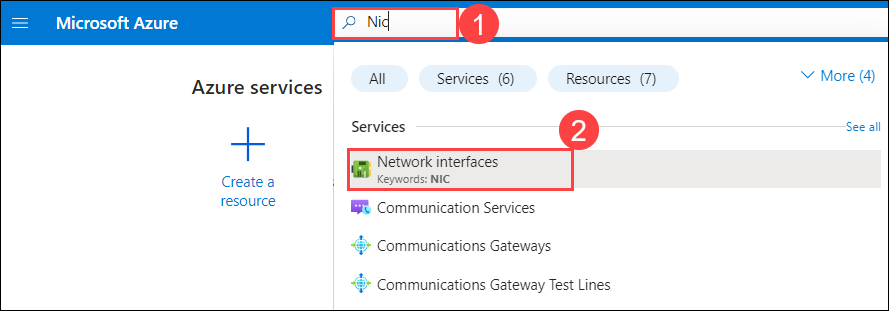
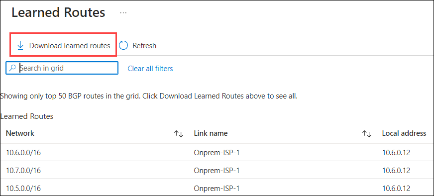

# Exercise 3: Review Default routing in Virtual WAN

In this exercise, you will review the default vWAN any-to-any connectivity routing.

## Task 1: Default routing for Virtual Network connections

1. Navigate to the home page in the Azure portal, type **Virtual WANs (1)** in the search box and select **Virtual WANs (2)** from the results.

    

1. On the **Virtual WANs** page, select **vwan-prod-001**.

   

1. On the **Basics** tab of the **vwan-prod-001** page, select **Virtual network connections** under the Connectivity section from the left navigation pane.

    

1. Review the default routing configuration for a Vnet connection (all connections are configured in the same way). Browse to the virtual wan under the Virtual network connections.

    


     **Note the Default settings:** 

    - Propagate Default route table is Enabled 

    - The connection is associated with the Default route table. 

    - Propagate to None is disabled. 

    - The connection is propagating to the Default route table 

    - The connection is propagating to the Default label

      


## Task 2. Default route effective routes

1. Navigate to the **Basics** tab of the **vwan-prod-001** page, select **Hubs (1)** under the Connectivity section from the left navigation pane, and then click on **vwan-hub-prod-001 (2)**.

    

1. Select **Effective Routes (1)** under Routing, and select the following information:

   - Select **Route Tables (2)** from the dropdown for Choose resource type.

   - Select **Default (3)** from the dropdown for Resource.

     


    >**Note:** Similar results using Azure CLI in Cloud Shell: (Fill out the variables for the subscription ID, Resource group name and virtual hub name)

    >**Note:** Make sure you replace the DID with <inject key="DeploymentID" enableCopy="false"/>

    ```Bash
    # Assign values to variables
    SubscriptionID="your_subscription_id"
    rg="Sharedservices-RG-DID"
    hubname="vwan-hub-prod-001"

    # Retrieve the route table ID for the default route table in the virtual hub
    vhubdefaultrtid=$(az network vhub route-table show --name defaultRouteTable --resource-group $rg --vhub-name $hubname --query id -o tsv)

    # Use Azure CLI to get the effective routes from the specified route table in the virtual hub
    # The query parameter is used to format the output with specific fields
    # The output is then passed to awk for further processing
    az network vhub get-effective-routes --resource-type RouteTable --resource-id $vhubdefaultrtid -g $rg -n $hubname --query 'value[].{Prefix:addressPrefixes[0],ASPath:asPath,NextHopType:nextHopType,NextHop:nextHops[0],Origin:routeOrigin}' -o table | awk '{ gsub(/\/subscriptions\/'$SubscriptionID'\/resourceGroups\/'$rg'\/providers\/Microsoft.Network\//,""); print }'
    ```

    

1. What do you notice from the above output? Where are these routes coming from? This is the default vWAN for any-to-any connectivity. Because both VNet and Branch connections are propagating to the Default Route table, these routes are programmed in the Default route table:

    - Spoke vNets directly connected to the virtual hub

    - Branch connections (VPN Gateway) directly connected to vhub-1

    - Spoke vnets connected to vhub-2 learned from hub-to-hub connectivity.

    - Branches connected to vhub-2 learned from hub-to-hub connectivity.

## Task 3: VM network interface effective routes

1. In the Azure portal, type **Nic (1)** in the search box and select **Network interfaces (2)** from the results.

    

1. Click on the **nic-spoke1-<inject key="DeploymentID" enableCopy="false"/>**.

    

1. Select **Effective routes** under the Help section and you should see a list of associated route tables. This information provides details about the routes currently in effect.

    

    >**Note:** Similar results using Azure CLI in Cloud Shell: (Fill out the variables for the subscription ID, Resource group name and virtual hub name).

    >**Note:** Make sure you replace the DID with <inject key="DeploymentID" enableCopy="false"/>

    ```Bash
    ## Set the resource group and NIC name variables
    rg="Prod-RG-DID"
    nicname="nic-spoke1-DID"

    ## Use Azure CLI to show the effective route table for the specified NIC
    az network nic show-effective-route-table --resource-group $rg --name $nicname --output table
    ```

    


1. What do you notice from the above output? What are these networks, and where do they come from? Because the VM in the spoke vNet is associated with the Default Route table in Virtual Hub, it similarly receives the same routes from the prior step and allows it to reach networks connected to the virtual WAN, plus the additional vhub-1 network (10.4.0.0/16).

## Task 4: Virtual Hub effective routes

This task helps you monitor Virtual WAN site-to-site VPN BGP information using the BGP Dashboard. Using the BGP dashboard, you can monitor BGP peers, advertised routes, and learned routes. The BGP dashboard is available for site-to-site VPNs that are configured to use BGP. The BGP dashboard can be accessed on the page for the site that you want to monitor.

### **Create a BGP Peers**

1. In the Azure portal, type **Virtual networks (1)** in the search box and select **Virtual networks (2)** from the results.

    

1. Click on **vnet-shared-services-<inject key="DeploymentID" enableCopy="false"/>**.

1. Copy the **Address space** and paste it into Notepad for later use.

1. Navigate to the home page in the Azure portal, type **Virtual WANs (1)** in the search box and select **Virtual WANs (2)** from the results.

    

1. On the **Virtual WANs** page, select **vwan-prod-001**.

   

1. On the **vwan-prod-001** page, select **Hubs (1)** under the Connectivity section from the left navigation pane, and then click on **vwan-hub-prod-001 (2)**.

    

1. On the **vwan-hub-prod-001** Virtual HUB page, select **BGP Peers** under Routing.

    

1. On the BGP Peers page, click **+ Add** to add a BGP peer.

    

1. Under the **Add BGP Peer** page, enter or select the following information.

    - Name: Enter **BGP-Peer (1)**

    - ASN: Enter **65510 (2)**

    - IPv4 address: Enter the **Address space (3)** that you copied in step 3

    - Virtual Network connection: Select **onprem-vnet-001 (4)**

    - Select **Add (5)**

        

1. On the **BGP Peers** page, copy one of the **IP** and save it to notepad for later use.

    

1. On the **vwan-hub-prod-001** Virtual HUB page, select **VPN (Site to site) (1)** under Connectivity section and click on **on-prem (2)** to open the VPN site.

    

1. Click on **eclipse (...) (1)**, and select **Edit link (2)**.

    

1. On the **Edit link** page, enter the following information:

    - Link BGP address: Enter the **IP (1)** that you copied in step 10.

    - Link ASN: Enter **65510 (2)**

    - Click on **Confirm (3)**

        

1. On the **on-prem** Virtual HUB page, select **BGP Dashboard** under Connectivity section.

    

1. You should see a list of BGP Peers. This information provides details about the currently active routes.


1. To download this information to a CSV file, click **Download BGP peers** at the top of the page.

    

1. What do you notice from this view? These are the BGP peer connections between the VPN gateway in the virtual hub and the VPN on-premises.

### **Advertised routes**

The **Advertised Routes** page contains the routes that are being advertised to remote sites.

1. On the **BGP Peers** page, click **Routes the site-to-site gateway is advertising** to show the **Advertised Routes** page.

    

1. On the **Advertised Routes** page, you can view the top 50 BGP routes. To view all routes, click **Download advertised routes**.

    

1. What do you notice about this page? These are the routes that the Virtual WAN VPN Gateway is advertised from on-premises via VPN.

### **Learned routes**

The **Learned Routes** page shows the routes that are learned.

1. On the **BGP Dashboard** page, click **Routes the site-to-site gateway is learning** to show the **Learned Routes** page.

    

1. On the **Learned Routes** page, you can view the top 50 BGP routes. To view all routes, click **Download learned routes**.

    

1. What do you notice about this page? These are the routes that the Virtual WAN VPN Gateway is learning from on-premises via VPN.

### **BGP Peer Virtual network gateway**

1. In the Azure portal, type **Virtual network gateway (1)** in the search box and select **Virtual network gateway (2)** from the results.

    

1. Click on **vpn-gateway-prod-001**.

    

1. On the **vpn-gateway-prod-001** page, select **Configuration (1)** under Settings section and select or enter the following details:

    - **Active-active mode (1):** Enabled

    - Select **Add new** under SECOND PUBLIC IP ADDRESS and enter name as **BGP-IP (2)**

    - Check the box for **Configure BGP (4)**

    - **Autonomous system number (ASN) (5)**: 65510

    - Select **Save (6)**

      

1. On the **vpn-gateway-prod-001** page, select **BGP peers** under Monitoring section and You should see a list of BGP Peers. This information provides details about the currently active routes.

    

    >**Note:** Similar results using Azure CLI in Cloud Shell: (Fill out the variables for the Resource group name and virtual network gateway name).

    >**Note:** Make sure you replace the DID with <inject key="DeploymentID" enableCopy="false"/>

    ```Bash
    ## Set the resource group and gateway name variables
    rg="Onprem-RG-DID"
    gatewayname="vpn-gateway-prod-001"

    ## Display the list of BGP peer statuses for the Azure network VNet gateway
    az network vnet-gateway list-bgp-peer-status -g $rg -n $gatewayname -o table 
    ```
    

1. What do you notice about this page? It displays the BGP peer corresponding to the VPN GW in the virtual Hub (Instance 0 and 1) and the routes learned from the virtual WAN VPN connection: 

    - vhub-1 network 

    - Spoke vNets directly connected to the virtual hub

    - Branch connections (VPN Gateway) directly connected to vhub-1

    - Spoke vnets connected to vhub-2 learned from hub-to-hub connectivity. 

    - Branches connected to vhub-2 learned from hub-to-hub connectivity. 

## Task 5: Branch effective routes

1. In the Azure portal, type **Nic (1)** in the search box and select **Network interfaces (2)** from the results.

    

1. Click on the **onpremlabvm-nic**.

    

1. Select **Effective routes** under the Help section and you should see a list of associated route tables. This information provides details about the routes currently in effect.

    

    >**Note:** Similar results using Azure CLI in Cloud Shell: (Fill out the variables for the subscription ID, Resource group name and virtual hub name)

    >**Note:** Make sure you replace the DID with <inject key="DeploymentID" enableCopy="false"/>

    ```Bash
    ## Set the resource group and NIC name variables
    rg="Onprem-RG-DID"
    nicname="onpremlabvm-nic"

    ## Use Azure CLI to show the effective route table for the specified NIC
    az network nic show-effective-route-table --resource-group $rg --name $nicname --output table
    ```

    

1. What do you notice from the above output? What are these networks, and where do these routes come from? The VM on the on-premises vNet has routes programmed (default virtual WAN Any-to-Any connectivity) that allow it to connect to any network connected to the virtual WAN. This includes: 
    - vhub-1 network
    - Spoke vnets connected to vhub-1
    - Spoke vnets connected to vhub-2 learned from hub-to-hub connectivity. 
    - Branches connected to vhub-2 learned from hub-to-hub connectivity.

## Summary

In the previous steps, you learned the default virtual WAN Any-to-Any routing associations and propagations and verified how they are programmed in the different components.  
