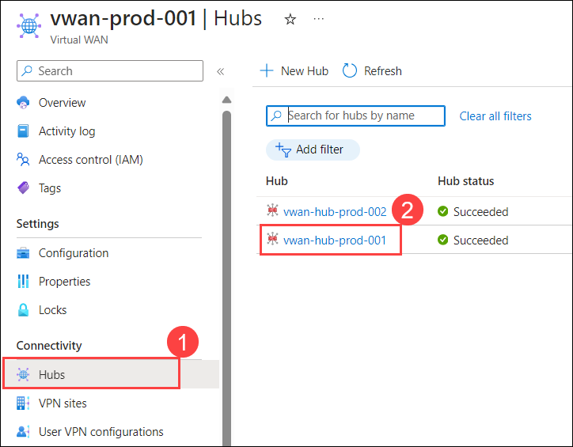
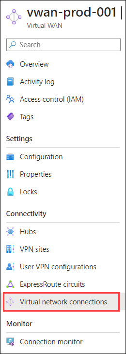
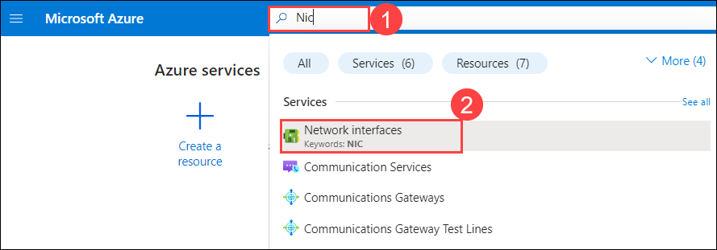

# Exercise 4: Virtual WAN custom routing

In this exercise you will create custom routing scenarios. 

As you learned from previous exercise the default routing in virtual WAN is Any-to-Any, but there are cases where you want to have custom routing.

## Task 1: Sample Scenario #1  

An on-premises connection should not have access to another branch connection transiting Virtual WAN (hub-to-hub connectivity).

1. Navigate to the home page in the Azure portal, type **Virtual WANs (1)** in the search box and select **Virtual WANs (2)** from the results.

    

1. On the **Virtual WANs** page, select **vwan-prod-001**.

   

1. On the **Basics** tab of the **vwan-prod-001** page, select **Hubs (1)** under the Connectivity section from the left navigation pane, and then click on **vwan-hub-prod-001 (2)**.

    

1. On the **vwan-hub-prod-001** Virtual HUB page, select **Route Tables** under Routing.

1. Select the **Default** route table.

1. Select **Propagations** tab.

1. Toggle to **No** the Propagate routes from connections to this route table? option. 

1. Review the effective routes routing on the VM Nic on each on-premises network.

## Task 2: Sample Scenario #2

In this sample scenario, in addition to Scenario 1: 

- Azure VNets will be segmented into 2 separate trusted zones. Zone-1 and Zone-2: 

    - vnet-spoke1-<inject key="DeploymentID" enableCopy="false"/> on vhub-1 and vnet-spoke3-<inject key="DeploymentID" enableCopy="false"/> on vhub-2 will be members of Zone-1 and should be allowed to connect to each other but not to vnet-spoke2-<inject key="DeploymentID" enableCopy="false"/> and vnet-spoke4-<inject key="DeploymentID" enableCopy="false"/> which will members of Zone-2.

    - vnet-spoke2-<inject key="DeploymentID" enableCopy="false"/> on vhub-1 and vnet-spoke4-<inject key="DeploymentID" enableCopy="false"/> on vhub-2 (Zone-2) should be allowed to connect to each other but not to vnet-spoke1-<inject key="DeploymentID" enableCopy="false"/> on-vhub-1 and vnet-spoke3-<inject key="DeploymentID" enableCopy="false"/> on vhub-2 which will members of Zone-1.

- On-premises network should only access Azure vNets directly connected to their VPN connection and not across Virtual WAN hub-to-hub connectivity. 

- You will create a total of 4 route tables, 2 route tables on each hub like the below: 

   - rt-hub1-zone-1 

   - rt-hub1-zone-2 

   - rt-hub2-zone-1 

   - rt-hub2-zone-2 

- Each vnet connection will be associated with its own route table respectively. 

    - vnet-spoke1-<inject key="DeploymentID" enableCopy="false"/> on vhub-1 with rt-hub1-zone-1

    - vnet-spoke2-<inject key="DeploymentID" enableCopy="false"/> on vhub-1 with rt-hub1-zone-2 

    - vnet-spoke3-<inject key="DeploymentID" enableCopy="false"/> on vhub-2 with rt-hub2-zone-1 

    - vnet-spoke4-<inject key="DeploymentID" enableCopy="false"/> on vhub-2 with rt-hub2-zone-2

- 2 labels will be created: zone-1 and zone-2 that will be used on each route table.

### Create Route tables for rt-hub1-zone-1

1. Navigate to the home page in the Azure portal, type **Virtual WANs (1)** in the search box and select **Virtual WANs (2)** from the results.

    

1. On the **Virtual WANs** page, select **vwan-prod-001**.

   

1. On the **Basics** tab of the **vwan-prod-001** page, select **Hubs (1)** under the Connectivity section from the left navigation pane, and then click on **vwan-hub-prod-001 (2)**.

    

1. On the **vwan-hub-prod-001** Virtual HUB page, select **Route Tables** under Routing and Select **+ Create Route Table**.

1. Enter the Name of Route table named as **rt-hub1-zone-1** and click **Next : Labels >**.

1. Create a label for **zone-1** and click **Next : Associations >**.

1. Select only the **vnet-spoke1-<inject key="DeploymentID" enableCopy="false"/>** from the list and click **Next : Propagations >**.

1. Under Branches (Site VPN/ExpressRoute/User VPN).

1. For the Propagate routes from connections to this route table? Select **Yes** to the toggle.

1. For the Propagate routes from all branch connections to these labels across virtual WAN, Unselect all labels (0 selected). This will ensure that only the local branch connection is learned and not remote branch connections.

1. Under Virtual Networks. Leave or ensure there is nothing selected (0 Selected). 

1. Click **Create**.

### Create Route tables for rt-hub1-zone-2

1. On the **vwan-hub-prod-001** Virtual HUB page, select **Route Tables** under Routing and Select **+ Create Route Table**.

1. Enter the Name of Route table named as **rt-hub1-zone-2** and click **Next : Labels >**.

1. Create a label for **zone-2** and click **Next : Associations >**.

1. Select only the **vnet-spoke2-<inject key="DeploymentID" enableCopy="false"/>** from the list and click **Next : Propagations >**.

1. Under Branches (Site VPN/ExpressRoute/User VPN).

1. For the Propagate routes from connections to this route table? Select **Yes** to the toggle.

1. For the Propagate routes from all branch connections to these labels across virtual WAN, Unselect all labels (0 selected). This will ensure that only the local branch connection is learned and not remote branch connections.

1. Under Virtual Networks. Leave or ensure there is nothing selected (0 Selected). 

1. Click **Create**.

### Create Route tables for rt-hub2-zone-1

1. On the **Basics** tab of the **vwan-prod-001** page, select **Hubs (1)** under the Connectivity section from the left navigation pane, and then click on **vwan-hub-prod-002 (2)**.

    

1. On the **vwan-hub-prod-002** Virtual HUB page, select **Route Tables** under Routing and Select **+ Create Route Table**.

1. Enter the Name of Route table named as **rt-hub2-zone-1** and click **Next : Labels >**.

1. Create a label for **zone-1** and click **Next : Associations >**.

1. Select only the **vnet-spoke3-<inject key="DeploymentID" enableCopy="false"/>** from the list and click **Next : Propagations >**.

1. Under Branches (Site VPN/ExpressRoute/User VPN).

1. For the Propagate routes from connections to this route table? Select **Yes** to the toggle.

1. For the Propagate routes from all branch connections to these labels across virtual WAN, Unselect all labels (0 selected). This will ensure that only the local branch connection is learned and not remote branch connections.

1. Under Virtual Networks. Leave or ensure there is nothing selected (0 Selected). 

1. Click **Create**.

### Create Route tables for rt-hub2-zone-2

1. On the **vwan-hub-prod-002** Virtual HUB page, select **Route Tables** under Routing and Select **+ Create Route Table**.

1. Enter the Name of Route table named as **rt-hub2-zone-2** and click **Next : Labels >**.

1. Create a label for **zone-2** and click **Next : Associations >**.

1. Select only the **vnet-spoke4-<inject key="DeploymentID" enableCopy="false"/>** from the list and click **Next : Propagations >**.

1. Under Branches (Site VPN/ExpressRoute/User VPN).

1. For the Propagate routes from connections to this route table? Select **Yes** to the toggle.

1. For the Propagate routes from all branch connections to these labels across virtual WAN, Unselect all labels (0 selected). This will ensure that only the local branch connection is learned and not remote branch connections.

1. Under Virtual Networks. Leave or ensure there is nothing selected (0 Selected). 

1. Click **Create**.

### Configure custom routing

There are 2 configuration options to achieve the same objectives:     
    
- Propagating using labels for each zone (zone-1 and zone-2)
    
- Propagating using each route table respectively. Let’s explore using labels which is a simpler option. 

1. Navigate to the home page in the Azure portal, type **Virtual WANs (1)** in the search box and select **Virtual WANs (2)** from the results.

    

1. On the **Virtual WANs** page, select **vwan-prod-001**.

   

1. On the **Basics** tab of the **vwan-prod-001** page, select **Virtual network connections** under the Connectivity section from the left navigation pane.

    

1. For the **vnet-spoke1-<inject key="DeploymentID" enableCopy="false"/>**  for hub-1, select on the 3 dots (…) on the far right and select Edit virtual network connection.

1. Ensure selections as per below

1. The Propagate to route tables should be **0 selected**. 

1. Propagate to labels, select **zone-1** only. This will make the vnet connection propagate its routes to zone-1 which includes the route table rt-hub1-zone-1 and rt-hub2-zone-1.

1. For the **vnet-spoke2-<inject key="DeploymentID" enableCopy="false"/>**  for hub-1, select on the 3 dots (…) on the far right and select Edit virtual network connection.

1. Ensure selections as per below

1. The Propagate to route tables should be **0 selected**.

1. Propagate to labels, select **zone-2** only. This will make the vnet connection propagate its routes to the zone-2 which includes the route table rt-hub1-zone-2 and rt-hub2-zone-2.

1. For the **vnet-spoke3-<inject key="DeploymentID" enableCopy="false"/>**  for hub-2, select on the 3 dots (…) on the far right and select Edit virtual network connection.

1. Ensure selections as per below

1. The Propagate to route tables should be **0 selected**.

1. Propagate to labels, select **zone-2** only. This will make the vnet connection propagate its routes to the zone-1 which includes the route table rt-hub1-zone-1 and rt-hub2-zone-1.

1. For the **vnet-spoke4-<inject key="DeploymentID" enableCopy="false"/>**  for hub-2, select on the 3 dots (…) on the far right and select Edit virtual network connection.

1. Ensure selections as per below

1. The Propagate to route tables should be **0 selected**.

1. Propagate to labels, select **zone-2** only. This will make the vnet connection propagate its routes to the zone-2 which includes the route table rt-hub1-zone-2 and rt-hub2-zone-2.

1. Your route tables for each hub should look like this:

1. This means that: 

    - The Default route table has branch connections associated with it (2 association) and propagating to it (2 propagation).  

    - Each custom route table is associated with its vnet-connection respectively (1 association) and the branch connection is propagating to it (1 association)

### Verify routing

1. In the Azure portal, type **Nic (1)** in the search box and select **Network interfaces (2)** from the results.

    

1. Click on the **nic-spoke1-<inject key="DeploymentID" enableCopy="false"/>**.

1. Select **Effective routes** under the Help section.

