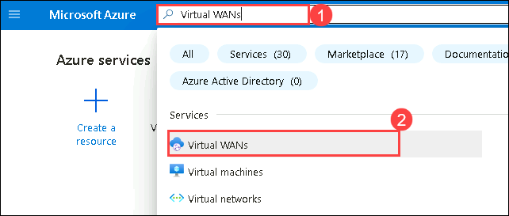

# Exercise 4: Virtual WAN custom routing

In this exercise you will create custom routing scenarios. 

As you learned from previous exercise the default routing in virtual WAN is Any-to-Any, but there are cases where you want to have custom routing.

## Task 1: Sample Scenario #1  

An on-premises connection should not have access to another branch connection transiting Virtual WAN (hub-to-hub connectivity).

1. Navigate to the home page in the Azure portal, type **Virtual WANs (1)** in the search box and select **Virtual WANs (2)** from the results.

    

1. On the **Virtual WANs** page, select **vwan-prod-001**.

   

1. On the **Basics** tab of the **vwan-prod-001** page, select **Hubs (1)** under the Connectivity section from the left navigation pane, and then click on **vwan-hub-prod-001 (2)**.

    

